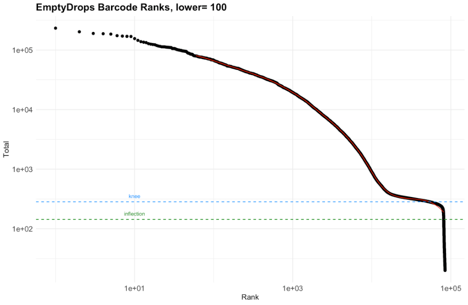
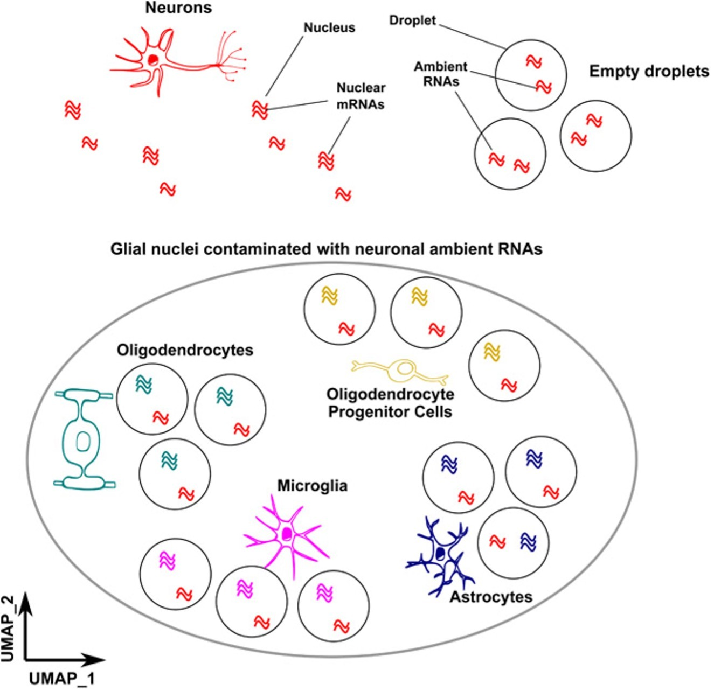

```{r setup, include = FALSE}
knitr::opts_chunk$set(
  collapse = TRUE,
  comment = "#>"
)
library(DropSift)
```

# Introduction

Accurate nuclei selection is a critical step in single-cell RNA sequencing (scRNA-seq) analysis. Proper identification of nuclei ensures robust downstream expression quantification, cell type classification, and biological interpretation. However, distinguishing nuclei from empty droplets presents unique challenges, particularly in brain tissue, where high cellular diversity, ambient RNA contamination, and debris can complicate classification.
Challenges of Nuclei Selection

Nuclei differ from whole cells in several ways:

-   They tend to have fewer captured UMIs, making it harder to distinguish them from background signal.
-   The relative proportion of ambient RNA is higher, leading to potential contamination.
-   The process of nuclei isolation from tissue can introduce debris, further complicating classification.
    
## EmptyDrops and Barcode Rank Plots
A commonly used method for distinguishing cells from empty droplets is emptyDrops, which learns the expression model of empty droplets, then tests each droplet to see if it is consistent with the empty droplet model.  This model has been implemented in both the DropletUtils package and has been modified by 10x genomics.  

EmptyDrops (and other methods) visualize the distribution of UMI counts as a [barcode rank plot](https://rdrr.io/github/MarioniLab/DropletUtils/man/barcodeRanks.html), to initialize the algorithm to initialize where a threshold where empty droplets should confidently be encountered.  In single-cell data, the transition between nuclei and empty droplets can be sharp, but nuclei's lower UMI counts and higher ambient RNA levels can obscure this transition. Barcode rank plots alone may not fully reveal the structure of the data, particularly the separation between nuclei, empty droplets, and debris.  This can lead to suboptimal initalization of empty and non-empty droplets, making classification difficult.

<style>
    img {
        border: 0;
    }
</style>
```{r, echo = FALSE, out.width="75%", fig.align="center"}

```

## A More Informative Visualization Approach

There are other features that can help clarify where the cell barcodes for these classes reside.  An important feature to consider is the fraction of reads that come from unspliced RNA.  Nuceli have a relatively higher proportion of their reads coming from unspliced RNA, and this can be used to help distinguish nuclei from empty droplets.  Instead of using a one-dimensional visualzation, we combine both UMI counts and the % intronic metric to uncover additional structure in a single nuclei experiment.  If we visualize the same data as above, the structure becomes more clear.

<style>
    img {
        border: 0;
    }
</style>
```{r, echo = FALSE, out.width="75%", fig.align="center"}
knitr::include_graphics("./images/nucleiExperimentStructure.png")
```

This visualization contains 3 main classes:

 - empty droplets are the highest center of density due to poisson loading of beads
 - nuclei are the second highest center of density, and have a higher proportion of intronic reads
 - debris are cell barcodes that have a much lower proportion of intronic reads, and tend to be smaller on average than nuclei.

The barcode rank visualization obscures the structure of the data, especially the debris class.  Debris tends to occur mostly in the intermediate UMI range, which can make the cumulative distribution plot difficult to interpret.  

While our lab has been visualizing data this way for quite some time, we're happy that other groups have also leveraged the same concept.  [DropletQC](https://genomebiology.biomedcentral.com/articles/10.1186/s13059-021-02547-0) is a software package that uses the same metrics to help identify empty droplets and damaged nuceli.  The visualization below is from the DropletQC manuscript. 

<style>
    img {
        border: 0;
    }
</style>
```{r, echo = FALSE, out.width="75%", fig.align="center"}
knitr::include_graphics("./images/DropletQCExample.png")
```

## A simple approach to nuclei selection
Given this structure in the data, one way to select nuclei is to use a simple thresholds on the UMI counts of cells and the % intronic metric.  The visualization below shows how the an example set of thresholds that could be generated by manual curation or by finding minimal density between clusters.  The red lines are simple threshold that could be used to select nuclei.  The appeal of this approach is that it's simple to implement and intuitive, but may be an imperfect approximation of where nuclei reside in the data.  The boundaries between nuclei and empty droplets may be non-linear, and may be harder to detect in data sets with higher ambient RNA contamination.


<style>
    img {
        border: 0;
    }
</style>
```{r, echo = FALSE, out.width="75%", out.height="75%", fig.align="center"}

```


## CellBender remove background

Another method for distinguishing nuclei from empty droplets is [CellBender's remove-background](https://github.com/broadinstitute/CellBender).  This method does not explicitly select cells or nuclei, but instead (like emptyDrops) nominates non-empty cell barcodes.  This estimate is neccesary to accomplish remove-background's most important and useful task - to generate expression profiles for all non-empty droplets with the ambient RNA removed.  

A [paper](https://pmc.ncbi.nlm.nih.gov/articles/PMC9789184/) by Caglayan et al. visualized this ambient RNA.  The key takeaway is that the ambient RNA (which is the average of expression of the captured nuceli) is co-captured by all droplets, which can obscure the true expression of the cells.

<style>
    img {
        border: 0;
    }
</style>
```{r, echo = FALSE, out.width="75%", out.height="75%", fig.align="center"}

```

Remove background visualizes its initialization somewhat similarly to EmptyDrops - the initialization algorithm is more complex and in practice seems more robust, but can suffer from the same initialization issues.  From their fine [documentation](https://cellbender.readthedocs.io/en/latest/usage/index.html#proposed-pipeline):

>If you have a dataset with so much background RNA that you cannot identify the “empty droplet plateau” yourself by eye, then remove-background will also likely have a difficult time. Running the algorithm might be worth a try, but you should strongly consider re-running the experiment, as this points to a real QC failure.

<style>
    img {
        border: 0;
    }
</style>
```{r, echo = FALSE, out.width="75%", fig.align="center"}

```

In general initialization is robust for most data sets, and yields a super set of the cell barcodes that are likely to be nuclei. By comparing the number of UMIs each cell barcode has before and after cellbender, we can calculate the fraction of UMIs subtracted.  This is calculated as:

\[
\text{Fraction of UMIs Removed} = 1 - \frac{\text{CellBender Processed UMIs}}{\text{Raw UMI Counts}}
\]

The visualization below shows how UMI removal varies with total number of UMIs and % intronic content.

<style>
    img {
        border: 0;
    }
</style>
```{r, echo = FALSE, out.width="75%", fig.align="center"}
knitr::include_graphics("./images/CellBender1.png")
```

## Introducing DropSift

DropSift is a method designed to distinguish nuclei from empty droplets using a support vector machine (SVM) classifier. It incorporates:

- Cell-level summary metrics, including UMI counts and % intronic.
- Expression-based features, informed by differential expression between nuclei and empty droplets.
- CellBender outputs (optional), which estimate ambient RNA contamination and further refine nuclei selection.

By integrating multiple signals, DropSift effectively differentiates nuclei from empty droplets while adapting to the variability in data structure—such as ambient RNA contamination—across different experiments and species. Rather than relying on tissue or organism-specific features, it learns expression patterns unique to each dataset to improve classification accuracy.

# How DropSift Works
While manual curation or simple thresholding can provide an intuitive way to select nuclei, this approach has limitations. The boundaries between nuclei and empty droplets may be non-linear and dataset-dependent, making it difficult to apply fixed thresholds across different experiments. In datasets with higher ambient RNA contamination, these boundaries become even less distinct.

To address these challenges, DropSift applies a support vector machine (SVM) classifier to differentiate nuclei from empty droplets. Rather than relying on predefined cutoffs, DropSift learns a decision boundary from known exemplars, allowing it to adapt to different datasets while maintaining high classification accuracy.

DropSift follows a structured workflow to classify nuclei and empty droplets using an SVM-based approach. The key steps are:

1. Identifying Exemplars: Selects high-confidence nuclei and empty droplets as training examples.
2. Feature Extraction: Computes key metrics (UMI count, % intronic, CellBender contamination, empty gene module score) for classification.
3. Training the SVM Classifier: Learns a dataset-specific decision boundary based on the selected exemplars.
4. Classifying Remaining Barcodes: Applies the trained classifier to assign nuclei and empty droplets to all remaining barcodes.

## Identifying Exemplars
There are two modes for selecting exemplars, depending on if CellBender remove background metrics are available.
The goal of this step is to select some plausible set of empty and non-empty droplets.  The selection does not need to be perfect, but should be representative of the data.  The exemplars are used to train the SVM classifier, and the classifier will be used to classify the remaining barcodes.

### With CellBender Remove Background
If CellBender has been run, then it has already generated some well tuned estimate of where empty and non-empty droplets are.  This greatly simplifies the process.

We use highest density region (HDR) selection provided by the [hdrcde](https://github.com/robjhyndman/hdrcde) package.  The HDR method selects the region of density containing a specified percentage of the data centered around the highest density.  A visualization of that process in 1 dimension is shown below, with colored bars indicating the interval that would be selected for different percentages of the data.

<style>
    img {
        border: 0;
    }
</style>
```{r, echo = FALSE, out.width="75%", fig.align="center"}
knitr::include_graphics("./images/HighestDensityRegionSelection.png")
```


- Empty exemplars are selected by calculating the highest density region (HDR) for cell barcodes that have had all of their UMIs removed by remove background.  The cell barcodes in the region that contains 75% of the data centered around the highest density are selected.  
- Nuclei exemplars are selected by the same HDR method for cell barcodes that have had less than 10% of their UMIs filtered by remove background, selecting the region of density containing 95% of those barcodes.

This results in the following exemplar selection, where exemplar empty droplets are contained in the red bounds, and exemplar nuclei are contained in the green bounds.
<style>
    img {
        border: 0;
    }
</style>
```{r, echo = FALSE, out.width="75%", fig.align="center"}

```

### Without CellBender Remove Background
When CellBender is available, it provides a well-calibrated estimate of which barcodes contain real nuclei and which represent empty droplets by explicitly modeling and removing ambient RNA contamination. However, when CellBender is not used, the problem becomes more complex. We must infer empty droplets and nuclei directly from the observed distribution of UMI counts and intronic content, without the benefit of an explicit contamination model. This is accomplished using a combination of heuristics, density estimation, highest density region (HDR) selection, and bandwidth optimization to identify the most representative exemplars for training the classifier.

#### Partitioning the Data: Finding the First Threshold

To separate empty droplets from nuclei-containing barcodes, we first need to identify a threshold in the distribution of UMI counts. The empty droplet population is typically the highest-density region in the data, corresponding to a well-defined cluster in any sufficiently loaded experiment. One way to conceptualize this process is by imagining a ball rolling down a density landscape. If we start at the peak of the density curve, where the empty droplets are most concentrated, and let the ball roll to the right, it will eventually settle in a local minimum—a region of lower density separating empty droplets from nuclei-containing barcodes. This minimum provides a natural threshold for partitioning the data into two groups: likely empty droplets and potential nuclei-containing barcodes.

Below is a plot of the 1D density estimate of log-transformed UMI counts. The largest peak corresponds to empty droplets, while the red line marks a plausible density minimum separating them from the second peak, which represents nuclei. This process is conceptually similar to identifying an inflection point in a barcode rank plot.

<style>
    img {
        border: 0;
    }
</style>
```{r, echo = FALSE, out.width="75%", fig.align="center"}
knitr::include_graphics("./images/BandwidthPlot1.png")
```

However, the challenge lies in ensuring that the density estimate is properly smoothed. If the density is undersmoothed, small fluctuations in the data can create spurious dips, causing the ball to get stuck prematurely before reaching the correct local minimum. Conversely, if the density is oversmoothed, real features in the distribution may be lost, making it difficult to detect the threshold at all. Striking the right balance in smoothing is critical to ensuring that the ball rolls past minor noise but stops at a meaningful density drop-off.

To achieve this, we systematically optimize the bandwidth of the density estimate.

#### Finding Well-Separated Exemplar Clusters

Selecting an optimal bandwidth for density estimation is not just about smoothing—it directly determines the final set of exemplars for empty droplets and nuclei. If the bandwidth is too small, the density estimate becomes overly sensitive to noise, leading to spurious local minima that don’t correspond to meaningful biological structure. If the bandwidth is too large, real features in the distribution are smoothed out, making it difficult to detect the transition between empty droplets and nuclei.

To systematically determine the optimal bandwidth while finalizing exemplar selection, we frame this as an optimization problem. The goal is to find the most well-separated, compact clusters of nuclei and empty droplets, ensuring that the classifier is trained on the most representative examples.

To quantify this, we use the silhouette score, which measures how distinct clusters are from one another. 

<style>
    img {
        border: 0;
    }
</style>
```{r, echo = FALSE, out.width="50%", out.heigh="50%", fig.align="center"}

```

The silhouette score is computed as:
<br /><br />

\[
s = \frac{b - a}{\max(a, b)}
\]

where:  
- \( a \) is the mean distance between a point and other points in the same cluster.  
- \( b \) is the mean distance between a point and the closest neighboring cluster.

<br />

The silhouette score ranges from -1 to 1, with higher silhouette scores indicate better-separated, more internally cohesive clusters, meaning that the chosen bandwidth produces a cleaner partitioning of nuclei and empty droplets. Since we apply clustering and compute silhouette scores iteratively across a range of bandwidth values, this process not only selects the best bandwidth but also finalizes the exemplars for training. 

To demonstrate how bandwidth selection affects exemplar identification, we systematically scan across multiple bandwidth settings and compute silhouette scores to evaluate clustering quality. The plot below shows the silhouette scores for different UMI count thresholds. A poor initial guess leads to a low silhouette score, whereas better thresholds—where clusters are more distinct—yield higher silhouette scores.

<style>
    img {
        border: 0;
    }
</style>
```{r, echo = FALSE, out.width="75%", out.heigh="75%", fig.align="center"}
knitr::include_graphics("./images/silhouette_score_scan.png")
```


In this dataset, we identify two plausible local maxima at approximately 3.3 and 3.8 log10 UMIs, corresponding to different density-based thresholds. The accompanying density plots illustrate how different choices of bandwidth affect exemplar selection. As we refine the bandwidth setting, we see changes in the separation between empty droplet and nucleus exemplars, with clearer cluster boundaries emerging at the optimal settings.  The two almost equal silhouette scores translate to very similar exemplar selection, where either solution is sufficient to begin training the SVM.

<style>
    img {
        border: 0;
    }
</style>
```{r, echo = FALSE, out.width="100%", fig.align="center"}

```


### Feature Extraction

Once exemplars for nuclei and empty droplets have been selected, we extract key cell-level features to train the classifier. These features capture relevant biological and technical properties that distinguish nuclei from empty droplets.

The violin plot below shows the distribution of selected features in the exemplar nuclei (green) and empty droplets (red). Some features, such as UMI counts and intronic content, exhibit clear separation between the two groups, while others may show more overlap.

<style>
    img {
        border: 0;
    }
</style>
```{r, echo = FALSE, out.width="75%", fig.align="center"}

```

To ensure features contribute effectively to classification:

- Large-scale features (e.g., transcript counts) are log-transformed to reduce skew.
- All features are standardized to follow a mean-zero, unit-variance distribution, preventing any single feature from dominating the model.
- While most features are well-separated between nuclei and empty droplets, some may have overlapping distributions, reinforcing the need for a multi-feature classification approach.

With these processed features, the next step is training the support vector machine (SVM) to classify nuclei.

### Empty Gene Module Score: Capturing Ambient RNA Signatures
Many of the features used for classification—such as transcript abundance and intronic content—capture broad distinctions between nuclei and empty droplets. But expression profiles also carry important information that can help refine these classifications. Inspired by emptyDrops, we take a simpler but effective approach: instead of modeling the full expression profile of each barcode, we construct a single feature that summarizes the genes most enriched in empty droplets.

To do this, we first need a way to compare the expression profiles of nuclei and empty droplets. The challenge is that empty droplets contain very few UMIs, making direct differential expression analysis difficult. To compensate, we create pseudobulked empty droplets by summing the expression of multiple low-UMI barcodes until each pooled sample has a library size comparable to a randomly selected exemplar nucleus. This allows for a meaningful comparison between the two groups.

Next, we perform differential expression analysis between these pseudobulked empty droplets and exemplar nuclei, using a Wilcoxon rank-sum test via [Seurat's FindMarkers](https://satijalab.org/seurat/reference/findmarkers) to identify genes that are strongly enriched in empty droplets. We rank genes by log2 fold change and take the top 100, which provides a robust set of genes that consistently differentiate empty droplets from nuclei.

Using this set of genes, we compute a gene module score for each barcode in the dataset using [Seurat’s AddModuleScore](https://satijalab.org/seurat/reference/addmodulescore) function. This score reflects how strongly a barcode expresses genes associated with empty droplets. In practice, nuclei tend to have low (negative) scores, while empty droplets have high scores, making this an additional useful feature for classification.

The plots below illustrate how the empty gene module score separates nuclei from empty droplets. The violin plot shows how exemplar nuclei and empty droplets differ in their module scores, while the scatter plot reveals how this feature varies across all barcodes in the dataset. This additional signal helps refine the classification, complementing the other features used by DropSift.

<style>
    img {
        border: 0;
    }
</style>
```{r, echo = FALSE, out.width="75%", fig.align="center"}
knitr::include_graphics("./images/EmptyGeneModuleScore.png")
```


## SVM

## Classifying Remaining Barcodes

# Running DropSift to distinguish nuclei from empties

```{r, eval=FALSE}
data(svmNucleusCallerInputs)
set.seed(1)
svmNucleusCaller = SvmNucleusCaller(
        svmNucleusCallerInputs$cellFeatures,
        svmNucleusCallerInputs$dgeMatrix,
        datasetName = "v3_Bamboo_18d_10X_RNAseq_Optiprep8000_CaH_17k_rxn1",
        useCBRBFeatures = FALSE)
selectedNuclei = svmNucleusCaller$cell_features[svmNucleusCaller$cell_features$is_cell,]$cell_barcode
head(selectedNuclei)
```

# Plotting the results

This function generates a multi-page report with plots of the SVM results.

```         
pdf("svmNucleusCallerReport.pdf")
plotSvmNucleusCaller(svmNucleusCaller)
dev.off()
```

<!-- Jim, the below is boilerplate when creating a dummy vignette.  I'm leaving it temporarily in case you find it useful. -->

Vignettes are long form documentation commonly included in packages. Because they are part of the distribution of the package, they need to be as compact as possible. The `html_vignette` output type provides a custom style sheet (and tweaks some options) to ensure that the resulting html is as small as possible. The `html_vignette` format:

-   Never uses retina figures
-   Has a smaller default figure size
-   Uses a custom CSS stylesheet instead of the default Twitter Bootstrap style

## Vignette Info

Note the various macros within the `vignette` section of the metadata block above. These are required in order to instruct R how to build the vignette. Note that you should change the `title` field and the `\VignetteIndexEntry` to match the title of your vignette.

## Styles

The `html_vignette` template includes a basic CSS theme. To override this theme you can specify your own CSS in the document metadata as follows:

```         
output: 
  rmarkdown::html_vignette:
    css: mystyles.css
```

## Figures

The figure sizes have been customised so that you can easily put two images side-by-side.

```{r, fig.show='hold'}
plot(1:10)
plot(10:1)
```

You can enable figure captions by `fig_caption: yes` in YAML:

```         
output:
  rmarkdown::html_vignette:
    fig_caption: yes
```

Then you can use the chunk option `fig.cap = "Your figure caption."` in **knitr**.

## More Examples

You can write math expressions, e.g. $Y = X\beta + \epsilon$, footnotes[^1], and tables, e.g. using `knitr::kable()`.

[^1]: A footnote here.

```{r, echo=FALSE, results='asis'}
knitr::kable(head(mtcars, 10))
```

Also a quote using `>`:

> "He who gives up [code] safety for [code] speed deserves neither." ([via](https://twitter.com/hadleywickham/status/504368538874703872))
