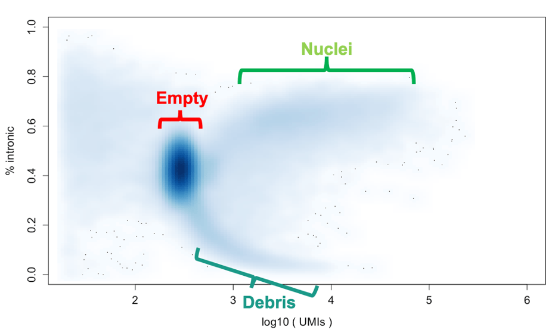
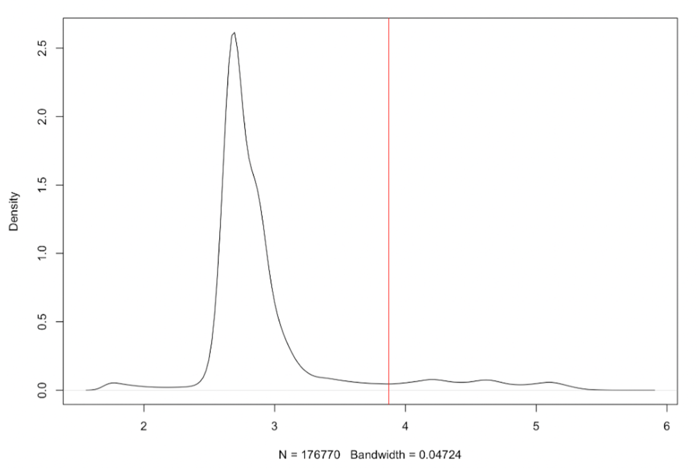
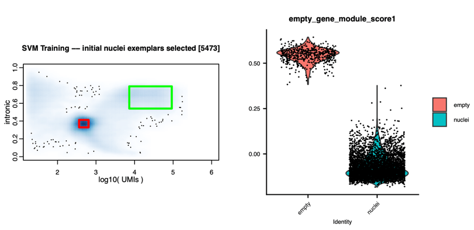

```{r setup, include = FALSE}
library(knitr)
knitr::opts_chunk$set(
  collapse = TRUE,
  comment = ""
)

library(logger)
library(DropSift)

logger::log_threshold(level=logger::INFO)   # Ensure INFO logs are captured
logger::log_appender(logger::appender_stdout)                # Redirect logs to R Markdown output
```

# Quickstart
To perform nucleus selection, DropSift requires two main inputs: a cell-level feature matrix and a digital gene expression (DGE) matrix. This section provides a minimal example using user-supplied data in standard formats.

## Input Data

The cell level feature matrix contains the cell barcode ID and per-cell summary statistics (column name in parenthesis)
    
    Cell Barcode ID (cell_barcode)
    Intronic fraction (pct_intronic)
    Mitochondrial content (pct_mt)

```{r, eval=TRUE, include=FALSE}
data(svmNucleusCallerInputs)
dropColumns <- c("num_transcripts", "num_reads", "frac_contamination")
cell_features <- svmNucleusCallerInputs$
    cellFeatures[, setdiff(colnames(svmNucleusCallerInputs$cellFeatures), dropColumns)]
```
    
<style>
table {
  font-size: 12px;
}
</style>

```{r, echo=FALSE}
# Display first few rows of the data frame
df <- head(cell_features)
rownames(df)=NULL

# Create a simple table
kable(df, format = "html")
```

The DGE matrix contains raw UMI counts for each gene (rows) across cell barcodes (columns). It should be supplied as either:

- A dense matrix (tab delimited text)
- A sparse matrix in 10x Genomics MTX format (matrix.mtx.gz with barcodes.tsv.gz and features.tsv.gz)

```{r, eval=TRUE, echo=FALSE}
dgeMatrix=svmNucleusCallerInputs$dgeMatrix
print (dgeMatrix[1:5,1:3])
```

## DropSift
To run DropSift, create an `SvmNucleusCaller` object with the cell features and DGE matrix. The `datasetName` parameter is optional and can be used to label the output plots.

```{r, eval=TRUE, include=TRUE, cache=FALSE, message=TRUE, warning=TRUE}
library(DropSift)
set.seed(1)
svmNucleusCaller = SvmNucleusCaller(
        cell_features,
        dgeMatrix,
        datasetName = "Test",
        useCBRBFeatures = FALSE)


```

Cell Barcodes selected as nuclei can be accessed from the `cell_features` data frame.

```{r, eval=TRUE, include=TRUE}
cf=svmNucleusCaller$cell_features
nuclei = cf[cf$is_cell==TRUE,]
```


```{r, echo=FALSE}
# Display first few rows of the data frame
df <- head(nuclei)
rownames(df)=NULL

# Create a simple table
kable(df, format = "html")
```


Alternatively, the Optimus Pipeline h5ad file format can be parsed to yield a cell metrics dataframe and a sparse DGE matrix.
```r
library(DropSift)

inputs=parseOptimusH5ad(h5ad_file = "path/to/h5ad_file.h5ad")

set.seed(1)
svmNucleusCaller = SvmNucleusCaller(
        inputs$cell_features,
        inputs$dge,
        datasetName = "Test (without remove-background)",
        useCBRBFeatures = FALSE)
```


See the [Running DropSift](#running-dropsift) section for more details on how to run DropSift with your own data.

Data used in this vignette is from a single sequencing reaction from the [BICAN](https://assets.nemoarchive.org/col-npe62xg) project.  Citation:

    Kathleen Kim, Lauren Macaisa, Sadie Drouin, Nirmala Rayan, Curtis Mello, Nafiseh Yavari, Olivia Yoo, Alec Wysoker, Khalid Shakir, Jim Nemesh, Seva Kashin, Melissa Goldman, Giulio Genovese, Haley Fritch, Marina Hogan, Katelyn Flowers, Emily Finn, Chuck Vanderburg, Kiku Ichihara, Evan Macosko, Steve McCarroll (2024) Population variability: Single nucleus RNAseq from postnatal human brain [Dataset]. Available from: https://assets.nemoarchive.org/col-npe62xg

# Introduction

Accurate nucleus selection is a critical step in single-cell RNA sequencing (scRNA-seq) analysis. Proper identification of nuclei ensures robust downstream expression quantification, cell type classification, and biological interpretation. However, distinguishing nuclei from empty droplets presents unique challenges, particularly in brain tissue, where high cellular diversity, ambient RNA contamination, and debris can complicate classification. Challenges of Nuclei Selection

Nuclei differ from whole cells in several ways:

-   They tend to have fewer captured UMIs, making it harder to distinguish them from background signal.
-   The relative proportion of ambient RNA is higher, leading to potential contamination.
-   The process of nucleus isolation from tissue can introduce debris, further complicating classification.

## EmptyDrops and Barcode Rank Plots

A commonly used method for distinguishing cells from empty droplets is emptyDrops, which learns the expression model of empty droplets, then tests each droplet to see if it is consistent with the empty droplet model. This model has been implemented in both the DropletUtils package and has been modified by 10x genomics.

EmptyDrops (and other methods) visualize the distribution of UMI counts as a [barcode rank plot](https://rdrr.io/github/MarioniLab/DropletUtils/man/barcodeRanks.html), to initialize the algorithm to initialize where a threshold where empty droplets should confidently be encountered. In single-cell data, the transition between nuclei and empty droplets can be sharp, but nuclei's lower UMI counts and higher ambient RNA levels can obscure this transition. Barcode rank plots alone may not fully reveal the structure of the data, particularly the separation between nuclei, empty droplets, and debris. This can lead to suboptimal initalization of empty and non-empty droplets, making classification difficult.


```{r, echo = FALSE, out.width="75%", fig.align="center"}
knitr::include_graphics("./images/emptyDropsBarcodeRank.png")
```

## A More Informative Visualization Approach

There are other features that can help clarify where the cell barcodes for these classes reside. An important feature to consider is the fraction of reads that come from unspliced RNA. Nuceli have a relatively higher proportion of their reads coming from unspliced RNA, and this can be used to help distinguish nuclei from empty droplets. Instead of using a one-dimensional visualzation, we combine both UMI counts and the % intronic metric to uncover additional structure in a single nucleus experiment. If we visualize the same data as above, the structure becomes more clear.


```{r, echo = FALSE, out.width="75%", fig.align="center"}

```

This visualization contains 3 main classes:

-   empty droplets are the highest center of density due to poisson loading of beads
-   nuclei are the second highest center of density, and have a higher proportion of intronic reads
-   debris are cell barcodes that have a much lower proportion of intronic reads, and tend to be smaller on average than nuclei.

The barcode rank visualization obscures the structure of the data, especially the debris class. Debris tends to occur mostly in the intermediate UMI range, which can make the cumulative distribution plot difficult to interpret.

While our lab has been visualizing data this way for quite some time, we're happy that other groups have also leveraged the same concept. [DropletQC](https://genomebiology.biomedcentral.com/articles/10.1186/s13059-021-02547-0) is a software package that uses the same metrics to help identify empty droplets and damaged nuceli. The visualization below is from the DropletQC manuscript.


```{r, echo = FALSE, out.width="75%", fig.align="center"}
knitr::include_graphics("./images/DropletQCExample.png")
```

## A simple approach to nuclei selection

Given this structure in the data, one way to select nuclei is to use a simple thresholds on the UMI counts of cells and the % intronic metric. The visualization below shows how the an example set of thresholds that could be generated by manual curation or by finding minimal density between clusters. The red lines are simple threshold that could be used to select nuclei. The appeal of this approach is that it's simple to implement and intuitive, but may be an imperfect approximation of where nuclei reside in the data. The boundaries between nuclei and empty droplets may be non-linear, and may be harder to detect in data sets with higher ambient RNA contamination.

```{r, echo = FALSE, out.width="75%", out.height="75%", fig.align="center"}
knitr::include_graphics("./images/ManualSelectionPlot.png")
```

## CellBender remove background

Another method for distinguishing nuclei from empty droplets is [CellBender's remove-background](https://github.com/broadinstitute/CellBender). This method does not explicitly select cells or nuclei, but instead (like emptyDrops) nominates non-empty cell barcodes. This estimate is neccesary to accomplish remove-background's most important and useful task - to generate expression profiles for all non-empty droplets with the ambient RNA removed.

A [paper](https://pmc.ncbi.nlm.nih.gov/articles/PMC9789184/) by Caglayan et al. visualized this ambient RNA. The key takeaway is that the ambient RNA (which is the average of expression of the captured nuceli) is co-captured by all droplets, which can obscure the true expression of the cells.

```{r, echo = FALSE, out.width="50%", out.height="50%", fig.align="center"}
knitr::include_graphics("./images/Neuronal_ambient_RNA_contamination.jpg")
```

Remove background visualizes its initialization somewhat similarly to EmptyDrops - the initialization algorithm is more complex and in practice seems more robust, but can suffer from the same initialization issues. From their fine [documentation](https://cellbender.readthedocs.io/en/latest/usage/index.html#proposed-pipeline):

> If you have a dataset with so much background RNA that you cannot identify the “empty droplet plateau” yourself by eye, then remove-background will also likely have a difficult time. Running the algorithm might be worth a try, but you should strongly consider re-running the experiment, as this points to a real QC failure.

```{r, echo = FALSE, out.width="100%", out.height="100%", fig.align="center"}
knitr::include_graphics("./images/CellBenderRankPlots.png")
```

In general initialization is robust for most data sets, and yields a super set of the cell barcodes that are likely to be nuclei. By comparing the number of UMIs each cell barcode has before and after cellbender, we can calculate the fraction of UMIs subtracted.

The fraction of UMIs removed is computed as:\
<br />

$$
f = 1 - \frac{U_{\text{CB}}}{U_{\text{raw}}}
$$

where:\
- $f$ is the fraction of UMIs removed.\
- $U_{\text{CB}}$ is the number of UMIs after CellBender processing.\
- $U_{\text{raw}}$ is the raw UMI count before CellBender processing.

<br />

The visualization below shows how UMI removal varies with total number of UMIs and % intronic content.

```{r, echo = FALSE, out.width="75%", fig.align="center"}
knitr::include_graphics("./images/CellBender1.png")
```

## Introducing DropSift

DropSift is a method designed to distinguish nuclei from empty droplets using a support vector machine (SVM) classifier. It incorporates:

-   Cell-level summary metrics, including UMI counts and % intronic.
-   Expression-based features, informed by differential expression between nuclei and empty droplets.
-   CellBender outputs (optional), which estimate ambient RNA contamination and further refine nucleus selection.

By integrating multiple signals, DropSift effectively differentiates nuclei from empty droplets while adapting to the variability in data structure—such as ambient RNA contamination—across different experiments and species. Rather than relying on tissue or organism-specific features, it learns expression patterns unique to each dataset to improve classification accuracy.

# How DropSift Works

While manual curation or simple thresholding can provide an intuitive way to select nuclei, this approach has limitations. The boundaries between nuclei and empty droplets may be non-linear and dataset-dependent, making it difficult to apply fixed thresholds across different experiments. In datasets with higher ambient RNA contamination, these boundaries become even less distinct.

To address these challenges, DropSift applies a support vector machine (SVM) classifier to differentiate nuclei from empty droplets. Rather than relying on predefined cutoffs, DropSift learns a decision boundary from known exemplars, allowing it to adapt to different datasets while maintaining high classification accuracy.

DropSift follows a structured workflow to classify nuclei and empty droplets using an SVM-based approach. The key steps are:

1.  Identifying Exemplars: Selects high-confidence nuclei and empty droplets as training examples.
2.  Feature Extraction: Computes key metrics (UMI count, % intronic, CellBender contamination, empty gene module score) for classification.
3.  Training the SVM Classifier: Learns a dataset-specific decision boundary based on the selected exemplars.
4.  Classifying Remaining Barcodes: Applies the trained classifier to assign nuclei and empty droplets to all remaining barcodes.

## Identifying Exemplars

There are two modes for selecting exemplars, depending on if CellBender remove background metrics are available. The goal of this step is to select some plausible set of empty and non-empty droplets. The selection does not need to be perfect, but should be representative of the data. The exemplars are used to train the SVM classifier, and the classifier will be used to classify the remaining barcodes.

### With CellBender Remove Background

If CellBender has been run, then it has already generated some well tuned estimate of where empty and non-empty droplets are. This greatly simplifies the process.

We use highest density region (HDR) selection provided by the [hdrcde](https://github.com/robjhyndman/hdrcde) package. The HDR method selects the region of density containing a specified percentage of the data centered around the highest density. A visualization of that process in 1 dimension is shown below, with colored bars indicating the interval that would be selected for different percentages of the data.

```{r, echo = FALSE, out.width="75%", fig.align="center"}

```

-   Empty exemplars are selected by calculating the highest density region (HDR) for cell barcodes that have had all of their UMIs removed by remove background. The cell barcodes in the region that contains 75% of the data centered around the highest density are selected.\
-   Nuclei exemplars are selected by the same HDR method for cell barcodes that have had less than 10% of their UMIs filtered by remove background, selecting the region of density containing 95% of those barcodes.

This results in the following exemplar selection, where exemplar empty droplets are contained in the red bounds, and exemplar nuclei are contained in the green bounds.

```{r, echo = FALSE, out.width="75%", fig.align="center"}
knitr::include_graphics("./images/ExemplarSelectionCBRB.png")
```

### Without CellBender Remove Background

When CellBender is available, it provides a well-calibrated estimate of which barcodes contain real nuclei and which represent empty droplets by explicitly modeling and removing ambient RNA contamination. However, when CellBender is not used, the problem becomes more complex. We must infer empty droplets and nuclei directly from the observed distribution of UMI counts and intronic content, without the benefit of an explicit contamination model. This is accomplished using a combination of heuristics, density estimation, highest density region (HDR) selection, and bandwidth optimization to identify the most representative exemplars for training the classifier.

#### Partitioning the Data: Finding the First Threshold

To separate empty droplets from nuclei-containing barcodes, we first need to identify a threshold in the distribution of UMI counts. The empty droplet population is typically the highest-density region in the data, corresponding to a well-defined cluster in any sufficiently loaded experiment. One way to conceptualize this process is by imagining a ball rolling down a density landscape. If we start at the peak of the density curve, where the empty droplets are most concentrated, and let the ball roll to the right, it will eventually settle in a local minimum—a region of lower density separating empty droplets from nuclei-containing barcodes. This minimum provides a natural threshold for partitioning the data into two groups: likely empty droplets and potential nuclei-containing barcodes.

Below is a plot of the 1D density estimate of log-transformed UMI counts. The largest peak corresponds to empty droplets, while the red line marks a plausible density minimum separating them from the second peak, which represents nuclei. This process is conceptually similar to identifying an inflection point in a barcode rank plot.

```{r, echo = FALSE, out.width="75%", fig.align="center"}

```

However, the challenge lies in ensuring that the density estimate is properly smoothed. If the density is undersmoothed, small fluctuations in the data can create spurious dips, causing the ball to get stuck prematurely before reaching the correct local minimum. Conversely, if the density is oversmoothed, real features in the distribution may be lost, making it difficult to detect the threshold at all. Striking the right balance in smoothing is critical to ensuring that the ball rolls past minor noise but stops at a meaningful density drop-off.

To achieve this, we systematically optimize the bandwidth of the density estimate.

#### Finding Well-Separated Exemplar Clusters

Selecting an optimal bandwidth for density estimation is not just about smoothing—it directly determines the final set of exemplars for empty droplets and nuclei. If the bandwidth is too small, the density estimate becomes overly sensitive to noise, leading to spurious local minima that don’t correspond to meaningful biological structure. If the bandwidth is too large, real features in the distribution are smoothed out, making it difficult to detect the transition between empty droplets and nuclei.

To systematically determine the optimal bandwidth while finalizing exemplar selection, we frame this as an optimization problem. The goal is to find the most well-separated, compact clusters of nuclei and empty droplets, ensuring that the classifier is trained on the most representative examples.

To quantify this, we use the silhouette score, which measures how distinct clusters are from one another.

```{r, echo = FALSE, out.width="50%", out.heigh="50%", fig.align="center"}
knitr::include_graphics("./images/silhouette_score.png")
```

The silhouette score is computed as: <br /><br />

$$
s = \frac{b - a}{\max(a, b)}
$$

where:\
- $a$ is the mean distance between a point and other points in the same cluster.\
- $b$ is the mean distance between a point and the closest neighboring cluster.

<br />

The silhouette score ranges from -1 to 1, with higher silhouette scores indicate better-separated, more internally cohesive clusters, meaning that the chosen bandwidth produces a cleaner partitioning of nuclei and empty droplets. Since we apply clustering and compute silhouette scores iteratively across a range of bandwidth values, this process not only selects the best bandwidth but also finalizes the exemplars for training.

To demonstrate how bandwidth selection affects exemplar identification, we systematically scan across multiple bandwidth settings and compute silhouette scores to evaluate clustering quality. The plot below shows the silhouette scores for different UMI count thresholds. A poor initial guess leads to a low silhouette score, whereas better thresholds—where clusters are more distinct—yield higher silhouette scores.

```{r, echo = FALSE, out.width="75%", out.heigh="75%", fig.align="center"}

```

In this dataset, we identify two plausible local maxima at approximately 3.3 and 3.8 log10 UMIs, corresponding to different density-based thresholds. The accompanying density plots illustrate how different choices of bandwidth affect exemplar selection. As we refine the bandwidth setting, we see changes in the separation between empty droplet and nucleus exemplars, with clearer cluster boundaries emerging at the optimal settings. The two almost equal silhouette scores translate to very similar exemplar selection, where either solution is sufficient to begin training the SVM.

```{r, echo = FALSE, out.width="100%", fig.align="center"}
knitr::include_graphics("./images/silhouette_score_scan_clusters.png")
```

## Feature Extraction

Once exemplars for nuclei and empty droplets have been selected, we extract key cell-level features to train the classifier. These features capture relevant biological and technical properties that distinguish nuclei from empty droplets.

The violin plot below shows the distribution of selected features in the exemplar nuclei (green) and empty droplets (red). Some features, such as UMI counts and intronic content, exhibit clear separation between the two groups, while others may show more overlap.

```{r, echo = FALSE, out.width="75%", fig.align="center"}
knitr::include_graphics("./images/FeatureViolinPlot.png")
```

To ensure features contribute effectively to classification:

-   Large-scale features (e.g., transcript counts) are log-transformed to reduce skew.
-   All features are standardized to follow a mean-zero, unit-variance distribution, preventing any single feature from dominating the model.
-   While most features are well-separated between nuclei and empty droplets, some may have overlapping distributions, reinforcing the need for a multi-feature classification approach.

With these processed features, the next step is training the support vector machine (SVM) to classify nuclei.

## Empty Gene Module Score: Capturing Ambient RNA Signatures

Many of the features used for classification—such as transcript abundance and intronic content—capture broad distinctions between nuclei and empty droplets. But expression profiles also carry important information that can help refine these classifications. Inspired by emptyDrops, we take a simpler but effective approach: we construct a single feature that summarizes the genes most enriched in empty droplets.

To do this, we first need a way to compare the expression profiles of nuclei and empty droplets. The challenge is that empty droplets contain very few UMIs, making direct differential expression analysis difficult. To compensate, we create pseudobulked empty droplets by summing the expression of multiple low-UMI barcodes until each pooled sample has a library size comparable to a randomly selected exemplar nucleus. This allows for a meaningful comparison between the two groups that avoids normalization issues where a single observation of a gene in an empty droplet with few transcripts can appear to be highly expressed.

Next, we perform differential expression analysis between these pseudobulked empty droplets and exemplar nuclei, using a Wilcoxon rank-sum test via [Seurat's FindMarkers](https://satijalab.org/seurat/reference/findmarkers) to identify genes that are strongly enriched in empty droplets. We rank genes by log2 fold change and take the top 100, which provides a robust set of genes that consistently differentiate empty droplets from nuclei.

Using this set of genes, we compute a gene module score for each barcode in the dataset using [Seurat’s AddModuleScore](https://satijalab.org/seurat/reference/addmodulescore) function. This score reflects how strongly a barcode expresses genes associated with empty droplets. In practice, nuclei tend to have low (negative) scores, while empty droplets have high scores, making this an additional useful feature for classification.

The plots below illustrate how the empty gene module score separates nuclei from empty droplets. The violin plot shows how exemplar nuclei and empty droplets differ in their module scores, while the scatter plot reveals how this feature varies across all barcodes in the dataset. This additional signal helps refine the classification, complementing the other features used by DropSift.


```{r, echo = FALSE, out.width="100%", fig.align="center"}

```

```{r, echo = FALSE, out.width="50%", out.height="50%", fig.align="center"}

```

## SVM

With a well-defined set of exemplars and extracted features, we can now train a support vector machine (SVM) classifier to distinguish nuclei from empty droplets. We use the e1071 R package to implement the SVM, leveraging its ability to learn complex decision boundaries.

Unlike simple thresholding, which applies fixed cutoffs, the SVM learns from the data itself, identifying an optimal boundary that separates nuclei from empty droplets based on multiple features. This allows it to handle nonlinear patterns that arise from differences in ambient RNA contamination, sequencing depth, and dataset-specific structure.

The SVM is trained using the selected exemplars:

-   Empty droplets (red) serve as negative training examples.
-   Nuclei (green) serve as positive training examples.

We use a radial basis function (RBF) kernel, which is well-suited for capturing nonlinear relationships in the data. The RBF kernel allows the SVM to learn flexible decision boundaries that can adapt to dataset-specific variation without overfitting.

```{r, echo = FALSE, out.width="75%", fig.align="center"}

```

After training, each barcode is assigned a classification score based on its position relative to the decision boundary. This score reflects how confidently the barcode is predicted to be a nucleus.

## Classifying Remaining Barcodes

With the SVM model trained, we can now classify all remaining barcodes. Each barcode is assigned a probability of being a nucleus, and classification follows a straightforward rule: if the predicted probability is ≥ 0.5, the barcode is classified as a nucleus; otherwise, it is labeled as an empty droplet.

One additional consideration is low-UMI barcodes—those with UMI counts smaller than the exemplar ambient RNA cell barcodes. These barcodes often contain too few transcripts for meaningful classification, yet they are clearly not nuclei. Rather than forcing a prediction, these barcodes are excluded from classification altogether, ensuring that only barcodes with sufficient transcript content are evaluated by the model.

This final classification step completes the nuclei selection process, producing a set of confidently identified nuclei while avoiding misclassification of barcodes that lack enough data for reliable labeling.

# Running DropSift

## Data Preparation

DropSift requires two main inputs: a cell-level feature matrix and a digital gene expression matrix.

Typical input data sources:

-   The Optimus Pipeline emits an5had file contains the necessary information, and can be directly processed.
-   A 10x Genomics CellRanger processed data set has a BAM file that can be processed to extract summary metrics, and a digital gene expression matrix in MTX format.

We'll load up a prepared data set to demonstrate how DropSift works.

```{r, eval=TRUE}
data(svmNucleusCallerInputs)
```

## DGE Matrix

The digital gene expression matrix contains the raw UMI counts for each gene in each barcode. The matrix has genes in rows and cell barcodes in columns, and can either be a dense matrix or a sparse matrix in [column compressed format](https://www.rdocumentation.org/packages/Matrix/versions/1.7-1/topics/CsparseMatrix-class). The Seurat package will parse MTX files into the appropriate sparse format via [Read10X](https://satijalab.org/seurat/reference/read10x)

```{r, eval=TRUE, echo=FALSE}
print (svmNucleusCallerInputs$dgeMatrix[1:5,1:3])
```

## Cell Level Features

The cell-level feature matrix contains summary metrics for each cell barcode:

-   num_reads: The number of uniquely mapped sequencing reads assigned to each barcode (optional, will be used to calculate reads/UMI as a measure of sequencing saturation in selected nuclei if included)
-   pct_intronic: The percentage of reads that map to intronic regions.
-   pct_mt: The percentage of reads that map to mitochondrial genes.
-   frac_contamination: The fraction of UMIs removed by CellBender (optional).


<style>
table {
  font-size: 12px;
}
</style>

```{r, echo=FALSE}
# Display first few rows of the data frame
df <- head(svmNucleusCallerInputs$cellFeatures)
rownames(df)=NULL

# Create a simple table
kable(df, format = "html")
```

## Preparing Cell Level Features

If you aren't running the Optimus Pipeline, you'll need to gather the cell-level features yourself. The cell-level features can be calculated from your BAM file plus an annotations file that is in [REFSEQ](https://genome.ucsc.edu/cgi-bin/hgTables?hgsid=1220235277_SJWvNhqI4wCU4FbY6LcxOLoaaC5l&hgta_doSchemaDb=macFas5&hgta_doSchemaTable=refFlat) or [GTF](http://useast.ensembl.org/info/website/upload/gff.html) format.  This annotations file should be the same one you used to generate the digital gene expression matrix.  

### Intronic and MT content
The [DropSeq](https://github.com/broadinstitute/Drop-seq/tree/master) software package provides tools to gather these metrics.  `SingleCellRnaSeqMetricsCollector` is an adaptation of the Picard tool [CollectRnaSeqMetrics](https://gatk.broadinstitute.org/hc/en-us/articles/360037057492-CollectRnaSeqMetrics-Picard).

From the fine documentation:

```It calculates the total numbers and the fractions of nucleotides within specific genomic regions including untranslated regions (UTRs), introns, intergenic sequences (between discrete genes), and peptide-coding sequences (exons). This tool also determines the numbers of bases that pass quality filters that are specific to Illumina data (PF_BASES).```

The tool is straight-forward to run on the command line:

```
/path/to/dropseq/SingleCellRnaSeqMetricsCollector -m 15884m 
TMP_DIR=/path/to/TMP 
I=/path/to/my.bam 
ANNOTATIONS_FILE=/path/to/gtf/GRCh38-2020-A.gtf 
O=/path/to/output/cell_level_metrics.txt
CELL_BARCODE_TAG=CB 
READ_MQ=10 
NUM_CORE_BARCODES=10000000 
MT_SEQUENCE=chrM 
```

The tool points at the input BAM and GTF files, and outputs a tab-delimited file with the metrics.  There are a few parameters that can be adjusted depending on your previous data processing.  Typically
cell barcodes are encoded by the BAM tag `CB`.  The `MT_SEQUENCE` parameter is the name of the mitochondrial chromosome in the GTF file, and may change with different GTF versions or organism builds. In this example, the number of barcodes to extract from the data `NUM_CORE_BARCODES` is set in excess of any single cell experiment, but you instead us the argument `CELL_BC_FILE` and supply a barcode file, for example the 10x Genomics cell barcode file from the unfiltered data directory `raw_feature_bc_matrix`.  

The output emits a number of columns, but the key columns to extract are:
```
    SAMPLE              PCT_MT_BASES       PCT_INTRONIC_BASES
    GTGGAGAGTCTTGAGT    0.008172           0.661067
    GCGGATCGTACGGGAT    0.000000           0.732363
    CTGAGCGGTGAGATTA    0.686182           0.178820
    ATGCGATGTGACTCTA    0.066698           0.530314
    GCACTAACACAGGATG    0.170902           0.135392
```
     
### Read Counts Per Cell
Gahtering read counts for each cell barcode can also be be accomplished with a DropSeq tool `BamTagHistogram`.  This is a general purpose tool that can count the number of reads assigned to any tag in BAM file.  To count uniquely mapped reads per cell, we pass in the cell barcode tag as the tag to count, and set the minimum mapping quality of reads to count.

```
/path/to/dropseq/BamTagHistogram -m 7692m 
TMP_DIR=/path/to/TMP 
I=/path/to/my.bam 
O=/path/to/output/read_counts.txt
CELL_BARCODE_TAG=CB 
READ_MQ=10 
```

The output contains two columns with no header.  The first column has the count of the tag, and the second the value of that tag.

```
2129761	TCAAGACAGGCTAACG
1781152	TTGAACGCATTACTCT
1627242	ATACCTTAGGATTTGA
1416453	CCGTTCACACCTCTAC
1361935	GGGACAAAGGCTAGCA
```


## Running DropSift to distinguish nuclei from empties
The test data set includes all of the optional cell level features, but we can run DropSift without them.  We'll let DropSift infer the number of transcripts from the DGE and omit the number of reads.  Additionally, we'll skip including the cellbender remove-background metric.  

This data set comes from a real single cell nuclei experiment, but has been downsampled to 10% of the cell barcodes present in the original experiment.

```{r, eval=TRUE, include=TRUE}
dropColumns <- c("num_transcripts", "num_reads", "frac_contamination")
cell_features <- svmNucleusCallerInputs$
    cellFeatures[, setdiff(colnames(svmNucleusCallerInputs$cellFeatures), dropColumns)]
```


<style>
table {
  font-size: 12px;
}
</style>

```{r, echo=FALSE}
# Display first few rows of the data frame
df <- head(cell_features)
rownames(df)=NULL

# Create a simple table
kable(df, format = "html")
```


```{r, eval=TRUE, include=TRUE, cache=FALSE, message=TRUE, warning=TRUE}
set.seed(1)
svmNucleusCaller = SvmNucleusCaller(
        cell_features,
        svmNucleusCallerInputs$dgeMatrix,
        datasetName = "Test (without remove-background)",
        useCBRBFeatures = FALSE)


```

The function emits a series of logging outputs to help you see that you've properly configured your input as well as track the algorithm's process.  In this small test data set, the algorithm runs quickly.  You should expect total run times on the order of 10-15 minutes for a full sized experiment.
<br />
# Results

The svmNucleusCaller object returns a number of elements.
```{r, eval=TRUE, include=TRUE, tidy=FALSE}
names (svmNucleusCaller)
```
The first critical element is the `cell_features` dataframe, which contains the original cell-level features, which cell barcodes were used to train the model, the classification score, and the classification label. The classification score is the probability that the cell barcode is a nucleus, and the classification label is the final classification based on the score.  By default, any cell barcode with a classification score >= 0.5 is considered a nucleus.  

The column `training_label_is_cell` is TRUE if the cell barcode was used to train the nucleus class, FALSE if used to train the empty class, and NA if not used in training.

Let's look at the first few cell barcodes that were not in the training set, but were classified as nuclei.  

```{r, eval=TRUE, include=TRUE}
cf=svmNucleusCaller$cell_features
nuclei_not_training = cf[is.na(cf$training_label_is_cell) & cf$is_cell==TRUE,]
```


```{r, echo=FALSE}
# Display first few rows of the data frame
df <- head(nuclei_not_training)
rownames(df)=NULL

# Create a simple table
kable(df, format = "html")
```

Getting a list of selected nuclei is as simple as filtering the cell_features dataframe for cell barcodes with a classification label of "nucleus" via `is_cell==T`.  This dataframe is saved to a file when running in command-line mode.

## Plots

The classifier also returns a number of plots, which are grouped into lists:
- `plots` list contains initialization and selection plots
- `featurePlot` is a single plot containing the distribution of features in the exemplar nuclei and empty droplets
- `geneModulePlots` list contains plots of the empty gene module score in the training data and in the full dataset.

If you'd like a nicely formatted PDF report that incorporates these plots, you can use the `plotSvmNucleusCaller` function.  This function generates a multi-page report with plots of the SVM results, and can be directed to a PDF file.

```{r, eval=FALSE}
pdf("svmNucleusCallerReport.pdf")
plotSvmNucleusCaller(svmNucleusCaller)
dev.off()
```

### Initialization and selection plots
The contents of the plots may differ if `frac_contaimination` is not included in the cell_features.  In that case, plots containing cellbender specific information will be empty.

In this example, `frac_contaimination` was not passed in, so we'll look at the non-empty plots.


```{r, eval=TRUE, include=TRUE}
names (svmNucleusCaller$plots)
```

```{r, eval=TRUE, include=TRUE, fig.align="center", fig.width=7, fig.height=5}
print (svmNucleusCaller$plots$initialization)
```
This is a 2d density plot that shows the regions where exemplar nuclei and empty droplets were selected.  The red region contains the exemplar empty droplets, and the green region contains the exemplar nuclei.  The title contains the total count of exemplar nuclei selected.  

```{r, eval=TRUE, include=TRUE, fig.align="center", fig.width=7, fig.height=5}
print (svmNucleusCaller$plots$selected_nuceli)
```
This plot shows which cell barcodes have been selected as nuclei.  

```{r, eval=TRUE, include=TRUE, fig.align="center", fig.width=7, fig.height=5}
print (svmNucleusCaller$plots$nuceli_probability)
```
This plot is limited to the cell barcodes that are classified as nuclei.  Nuclei are colored by their probability, which can be useful to understand where the classifer is less confident.  Lower confidence cell barcodes are typically seen in lower %intronic nuclei or in cell barcodes with lower UMI counts that are close to the ambient RNA center of density.

```{r, eval=TRUE, include=TRUE, fig.align="center", fig.width=7, fig.height=5}
print (svmNucleusCaller$plots$selected_nuclei_density)
```
This plot is a 2d density plot of all cell barcodes.  The red threshold lines are drawn at the minimum values of selected nuclei in each metric.  While the classifier selects nuclei with non-linear bounds, this plot can be useful to compare to a human-curated thresholding approach, where the expectation is that the classifier will draw these thresholds between the nuclei and empty droplets densities, and exclude the debris.

### Feature Plot
The feature plot shows the distribution of the features in the exemplar nuclei and empty droplets.  The expectation is that the features will be (mostly) separated between the two classes, so that the classifier can learn a decision boundary.  

```{r, eval=TRUE, include=TRUE, fig.align="center", fig.width=7, fig.height=5}
print (svmNucleusCaller$featurePlot)
```

## Empty Gene Module Score Plots

There are 2 plots that show the distribution of the empty gene module score in the training data and in the full dataset.  The empty gene module score is a measure of how much a cell barcode expresses genes that are enriched in empty droplets.  The expectation is that nuclei will have low scores, and empty droplets will have high scores. 

```{r, eval=TRUE, include=TRUE}
names (svmNucleusCaller$geneModulePlots)
```

### Exemplars
```{r, eval=TRUE, include=TRUE, fig.align="center", fig.width=7, fig.height=5}
print (svmNucleusCaller$geneModulePlots$training_data)
```
This plot shows the distribution of the empty gene module score in the nuclei and pseudobulked empty droplets used to train the classifier.  The score is mostly well separated between classes, but there are a small tail of exemplar nuclei with positive scores that slightly overlap with the empty droplets. This feature is useful for classification, but is not sufficient on it's own, especially in the presence of high ambient RNA contamination.

### Full Dataset
```{r, eval=TRUE, include=TRUE, fig.align="center", fig.width=7, fig.height=5}
print (svmNucleusCaller$geneModulePlots$empty_gene_module_score)
```
This plot shows the gene module score for all cell barcodes in the data set.  As expected, cell barcodes with higher UMIs and higher %intronic content tend to have lower scores.  In experiments with high ambient RNA contamination, some data sets will have less clear decision boundaries and may have a gradient of of scores between the empty droplets and nuclei.

# Running DropSift with CellBender Remove Background
This second covers a few additional QC plots that are generated when CellBender Remove Background metrics are included in the cell_features.  

```{r, eval=TRUE, include=TRUE, cache=FALSE, message=TRUE, warning=TRUE}
data(svmNucleusCallerInputs)

svmNucleusCaller = SvmNucleusCaller(
        svmNucleusCallerInputs$cellFeatures,
        svmNucleusCallerInputs$dgeMatrix,
        datasetName = "Test (without remove-background)",
        useCBRBFeatures = TRUE)


```

The cellbender frac_contamination is now available, and shows the gradient in UMIs that are removed by CellBender as a function of UMI count.  

```{r, eval=TRUE, include=TRUE, fig.align="center", fig.width=7, fig.height=5}
print (svmNucleusCaller$plots$cellbender)
```

The nucleus selection plot with the fraction of UMIs remaining after cellbender remove background:
```{r, eval=TRUE, include=TRUE, fig.align="center", fig.width=7, fig.height=5}
print (svmNucleusCaller$plots$selected_nuclei_density_rb)
```


# Running DropSift from the command line

If the data is in the correct format, nuclei selection can be run with a single API call `DropSift::runIntronicSVM` that reads in the input files and emits a dataframe of cell barcode data with labels, and a PDF containing quality control plots. For example, to process Optimus Pipeline outputs, you could run the following (assuming you have installed this package and it's on your R_LIBS path):

```         
Rscript -e 'DropSift::runIntronicSVM(datasetName="test", optimusH5File="/path/to/my.h5ad", outPDF="/path/to/output.pdf", outFeaturesFile="/path/to/output_report.txt")'
```

This method also supports supplying a DGE file in dense format or sparse 10x Genomics MTX format along side a cell-level feature file.  When passing in a DGE in MTX format, pass in the directory that contains the matrix.mtx.gz file, and the function will read in the matrix and the features.tsv.gz and barcodes.tsv.gz files to generate the DGE matrix.  If using 10x processed data, remember to pass in the unfiltred DGE matrix found in `raw_feature_bc_matrix`.  


```
Rscript -e 'DropSift::runIntronicSVM(datasetName="test", cellFeaturesFile="/path/to/my.cell_features.txt", dgeMatrixFile="/path/to/dge", outPDF="/path/to/output.pdf", outFeaturesFile="/path/to/output_report.txt")'
```

# Session Information

This section provides details about the R session and package versions used to generate this vignette.

```{r session-info, echo=FALSE}
sessionInfo()
```
